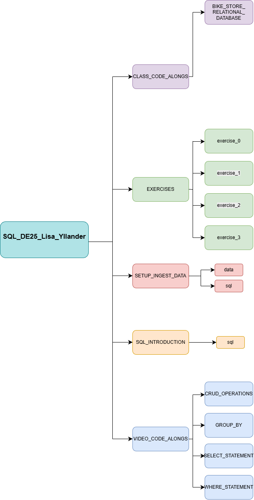

# 📚 SQL Portfolio: Coursework and Exercises

Welcome to my source code repository for the SQL course. This archive contains all course material, ranging from basic introduction to advanced exercises and code-alongs.

---

## 🚀 Getting Started (DuckDB Instructions)

All projects utilize **DuckDB** for managing database files (`.duckdb`) and ingesting data from CSV files.

1.  **Installation:** Ensure you have DuckDB installed locally (or within your environment).
2.  **Running an SQL file:** To execute an SQL file (e.g., for ingestion) from the terminal, navigate to the relevant folder and use:
    ```bash
    duckdb [database_file.duckdb] < [sql_file.sql]
    ```

---

## 🗺️ Project Structure and Content
### Visual overveiw



The repository is organized into the following main sections:

### 1. 📂 CLASS_CODE_ANLONG (Code Examples from Lectures in Class)

This section contains all code written during the class lectures, organized by topic.

| Module | Description |
| :--- | :------ | 
| **BIKE_STOR_RELATIONAL_DATABASE** | Create and join tables, ingest data and working with localhost (-ui) |

### 2. 📂 EXERCISES (Assignments)

This folder contains solutions and files for the independent assignments and exercises.

* **exercise_0**: Handles the Hemnet real estate dataset.
    * **Data:** `hemnet_data_clean.csv`
    * **Database:** `hemnet.duckdb`

### 3. 📂 SETUP_INGEST_DATA

Files related to setting up databases and ingesting raw data.

* **Examples:** `kursdata.db`, `kursdata.duckdb`, `yt_videos.duckdb`

### 4. 📂 SQL_INTRODUCTION (Fundamentals)

Basic SQL concepts and initial command syntax.

* **Files:** `create_table.sql`, `insert_jokes.sql`, `queries.sql` (Contains fundamental syntax to get started.)
* **Database:** `jokes.duckdb` (Example database)


### 1. 📂 VIDEO_CODE_ALONGS (Code Examples from Vidoe Lectures)

This section contains all code written during the video lectures, organized by topic.

| Module | Description | 
| :--- | :------ | :--- |
| **CRUD_OPERATIONS** | Create, Read, Update, and Delete data operations. | 
| **GROUP_BY** | Aggregation functions and data grouping. | 
| **SELECT_STATEMENT** | Basic `SELECT` and column selection. | 
| **WHERE_STATEMENT** | Detailed data filtering using `WHERE` clauses. |
---

## 🔗 Other Files

* `.venv`: Virtual Enviorment
* `.gitignore`: Specifies files (e.g., database binaries) that Git should ignore.
* `images`: Images used for this project.
